# Mantis foundation-model training

This repository adapts the MantisV2 time-series encoder to liquid futures. It
exports a model whose inputs are tracked. It then freezes the model, builds
embeddings, trains a small walk-forward classifier, and tests trades in a
rule-based simulator.

The project is named after the Mantis model family. The family contains Mantis,
Mantis+, and MantisV2. Only MantisV2 is built here. Mantis and Mantis+ provide
context and may become future baselines. They do not have runnable packages,
configs, or checkpoints in this repository.

## Current status

| Area | Status |
| --- | --- |
| MantisV2 repaired-Parquet MPS training, validation, and export | Complete under the current checkpoint-bound gate |
| Trend Magic downstream | Prepare and embedding complete; eight-fold head rejected by proper-score gates; simulation not authorized |
| Downstream 2026 holdout | Sealed |
| Mantis and Mantis+ repository implementations | Not implemented |

The following workflows are implemented:

- MantisV2 supervised NextLeg fine-tuning from pinned official weights.
- Leakage-safe train, validation, and reserved holdout construction.
- Resumable native checkpoints with tracked inputs.
- Validation-gated safetensors export with numeric parity checks.
- Multi-timeframe MantisV2 embedding generation.
- Purged walk-forward logistic classification.
- Config-selected Supertrend or Trend Magic candidates and Topstep 100K Combine simulation.
- A two-key, one-time downstream holdout workflow.

The current Apple MPS production run used the repaired 27-stream Parquet corpus,
early-stopped after 32 epochs, selected epoch 24, reproduced its best validation
loss, and passed checkpoint-bound safetensors parity. Trend Magic preparation
then produced 3,259,736 pre-holdout candidates and the embedding stage
completed. The eight-fold logistic head converged but did not beat the constant
log-loss and Brier baselines, so simulation remains blocked. See the
[current production run record](docs/runs/2026-07-20-mantisv2-nextleg-parquet-v2.md).

The following workflows are not implemented:

- Original Mantis training or inference.
- Mantis+ training or inference.
- Reproduction of CauKer synthetic-data generation.
- Reproduction of MantisV2 foundation pretraining.
- A qualified CUDA production recipe.
- Routine foundation-model holdout evaluation.
- Automated publication of models or results.

## Why this workflow exists

A traditional machine-learning pipeline depends on features chosen by people.
Examples include returns, moving averages, price range, and indicator values.
MantisV2 learns a compact view of each time-series window. That view may expose
useful shapes and links that a fixed feature list misses.

This repository does not replace traditional machine learning. It uses both
learned features and simple models:

1. The pretrained MantisV2 encoder supplies a general time-series starting point.
2. NextLeg fine-tuning adapts the encoder to causal futures targets.
3. Frozen embeddings make later tests stable and reusable.
4. Logistic regression produces a probability that is easy to audit.
5. Walk-forward tests, costs, fill timing, and account rules test whether the
   signal survives a trading plan.

The foundation model helps reuse learned features. It does not solve label
design, data leaks, regime change, fills, risk, or profit. Read
[Why the Mantis family is used](docs/mantis-family.md) before interpreting model
results.

## End-to-end data flow

```mermaid
flowchart LR
    A["27 repaired Parquet futures streams"] --> B["Per-stream causal splits and targets"]
    B --> C["MantisV2 NextLeg fine-tuning"]
    C --> D["Validation-selected best checkpoint"]
    D --> E["Parity-verified safetensors export"]
    E --> F["Frozen multi-timeframe embeddings"]
    F --> G["Purged walk-forward logistic model"]
    G --> H["Topstep rule and cost simulation"]
    H --> I["Sealed one-time holdout"]
```



See [System architecture](docs/architecture.md) for the contract at every arrow.

## Choose your reading path

### If you are new to machine learning

1. [Why the Mantis family is used](docs/mantis-family.md)
2. [System architecture](docs/architecture.md)
3. [Setup, dependencies, and hardware](docs/setup-and-hardware.md)
4. [End-to-end workflow](docs/workflow.md)
5. [Troubleshooting](docs/troubleshooting.md)

### If you operate training runs

1. [Setup, dependencies, and hardware](docs/setup-and-hardware.md)
2. [End-to-end workflow](docs/workflow.md)
3. [MantisV2 package reference](mantis-v2/README.md)
4. [Troubleshooting](docs/troubleshooting.md)

### If you are an AI agent

1. [AGENTS.md](AGENTS.md)
2. [AI-agent runbook](docs/agent-runbook.md)
3. The selected TOML config
4. [End-to-end workflow](docs/workflow.md)
5. The tests that enforce the relevant contract

## Safe first run

The safe first run uses synthetic data. It does not need the production futures
corpus or official model weights.

You need Python 3.12, `uv`, `just`, and Git. A sync can download packages. An AI
agent must get approval before running `just sync`.

```bash
just sync
just smoke
just downstream-smoke
```

Run the full local quality gate when no resource-sensitive production run is
active:

```bash
just gate
```

Smoke success proves that the stages work on small fake inputs. It does not prove
that official weights, real market data, Apple MPS, CUDA, full scale, or trading
results work.

## Production warning

The committed production configs record the current Apple Silicon host. They
contain absolute `/Volumes/Storage/...` paths and named output folders. Do not run
them unchanged on another machine. Do not reuse their run names for a new test.

Before production work:

1. Copy the relevant TOML config.
2. Set your own data path and artifact root.
3. Choose a new run name.
4. Select a supported device intentionally.
5. Keep `allow_overwrite=false`.
6. Validate the copied config through the staged workflow.

Never edit source, `uv.lock`, the active config, source data, or active output
files during a running or resumable job. A checkpoint is bound to these inputs.
See [Protect an active run](docs/workflow.md#protect-an-active-run).

## Repository layout

```text
mantis-foundation-model/
|-- AGENTS.md                   # Repository rules for AI agents
|-- README.md                   # Landing page and documentation map
|-- docs/
|   |-- mantis-family.md        # Concepts, rationale, and model limitations
|   |-- architecture.md         # Data flow and safety contracts
|   |-- setup-and-hardware.md   # Dependencies, paths, CPU, MPS, and CUDA
|   |-- workflow.md             # Human operator runbook
|   |-- agent-runbook.md        # Deterministic agent operating protocol
|   |-- troubleshooting.md      # Safe diagnosis and recovery
|   |-- runs/                   # Dated immutable run records
|   |-- adr/                    # Accepted architecture decisions
|   `-- research/               # Research and implemented specifications
|-- mantis-v2/
|   |-- configs/                # Versioned run definitions
|   |-- src/mantis_v2/          # Data, model, pipeline, and CLI code
|   |-- tests/                  # Executable safety contracts
|   `-- README.md               # MantisV2-specific reference
|-- justfile                    # Discoverable repository commands
|-- pyproject.toml              # Workspace and development dependencies
`-- uv.lock                     # Exact reproducible dependency resolution
```

Raw data, transformed data, native checkpoints, exported weights, embedding
shards, predictions, simulation results, caches, and secrets do not belong in
Git.

## Authoritative references

- MantisV2 semantics: [arXiv 2602.17868](https://arxiv.org/abs/2602.17868)
- Comparative research: [Time-series foundation models for trading](docs/research/2026-07-18-time-series-foundation-models-for-trading.md)
- Pinned source: `vfeofanov/mantis` tag `v1.0.0`, commit
  `0c94f8ceb9f1d1421dd292ed917090df8c31605b`
- Pinned weights: `paris-noah/MantisV2` revision
  `99fe0f548960e272fbfa4b82fd9b5b5956779dfd`
- Local pinning decision: [ADR 0001](docs/adr/0001-pin-and-isolate-mantis-v2.md)
- Local split-safety decision: [ADR 0002](docs/adr/0002-nextleg-split-safety.md)

Upstream license declarations conflict between Apache-2.0 and MIT. This
repository does not redistribute upstream source or weights and does not permit
publication of derived weights until the conflict is resolved.
