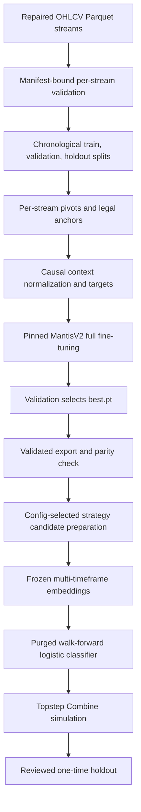
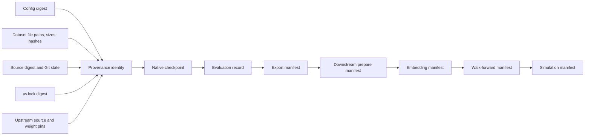

# System architecture

This document explains how data moves through the repository, which stage owns
each decision, and which contracts prevent leakage or stale artifacts.

## Design goals

The architecture is built around 6 goals:

1. Keep model-family implementations independent.
2. Preserve time causality from raw bars through simulated fills.
3. Make every long stage resumable or independently restartable.
4. Bind artifacts to exact data, source, config, dependencies, and upstream
   weights.
5. Separate predictive metrics from trading and account-rule metrics.
6. Keep the final holdout outside routine development.

Only MantisV2 has an implementation. `mantis/` and `mantis-plus/` remain reserved
until they have independent contracts and real consumers.

## End-to-end flow



Each box has its own inputs, outputs, and rejection conditions. Later stages
verify the identity of earlier artifacts before continuing.

## Repository boundaries

| Boundary | Owner | Rule |
| --- | --- | --- |
| Model-family code | `mantis-v2/` | Do not couple it to unimplemented families |
| Shared orchestration | Root `justfile` and workspace | Keep commands discoverable and version-neutral |
| Architecture decisions | `docs/adr/` | Record durable reasons, not operating logs |
| Run definitions | `mantis-v2/configs/*.toml` | Reject unknown or incompatible settings |
| Generated artifacts | Configured artifact root | Never commit them to Git |
| Raw and transformed data | External configured paths | Never copy them into the repository |

## Foundation adaptation pipeline

### Validate source streams

The current production NextLeg config expects 27 repaired Parquet streams:

- Symbols: ES, NQ, RTY, YM, GC, SI, CL, ZB, and ZN
- Intervals: 1 minute, 3 minutes, 5 minutes, and 15 minutes
- Filename pattern: `<SYMBOL>_<INTERVAL>.csv`
- Columns: `datetime,open,high,low,close,volume`

Every timestamp must parse as UTC, remain sorted, and be unique within its
stream. Every OHLCV value must be finite. The pipeline does not define how a data
vendor constructs continuous futures or adjusts rolls; the operator owns that
upstream data contract and licensing.

The corpus validated on 2026-07-20 contains 40,251,760 rows spanning July 14,
2021 through July 13, 2026. It contains nine symbols at 1m, 3m, and 15m and is
bound to a content-addressed corpus manifest. These counts describe that exact
corpus, not a portable requirement.

### Split each stream independently

The pipeline never concatenates instruments or intervals before target
construction. For each stream:

1. Bars at or after `2026-01-01T00:00:00Z` enter the reserved holdout.
2. The earlier region is split by row index.
3. The earliest 90% becomes training data.
4. The final 10% becomes validation data.

Independent splitting prevents one stream's date density from moving another
stream's boundary.

### Detect pivots and form legal anchors

NextLeg pivots are detected independently within each stream. A centered pivot
with `k=2` becomes knowable only after 2 later bars confirm it. Same-direction
duplicates are removed.

A training anchor is legal only when:

- Its entire context remains inside one split.
- Candle targets at 5, 10, 20, and 25 bars remain inside the split.
- Both future pivot legs remain inside the split.
- Each future leg is positive and no longer than the 256-bar cap.

The production reservation is:

```text
max_context + 2 x leg_cap = 200 + 2 x 256 = 712 bars
```

This reservation is intentionally longer than the 25-bar candle horizon.

### Build causal inputs and targets

Context length rotates among 64, 100, 150, and 200 raw bars. For each OHLCV
channel:

1. Calculate mean and standard deviation from context bars only.
2. Floor standard deviation at `1e-6`.
3. Standardize the context and clamp it to `[-10, 10]`.
4. Resize the context to 512 values.
5. Normalize future values using the same context-only statistics.
6. Clamp future normalized values to `[-10, 10]`.
7. Subtract the current standardized value from each future value.

The candle target is shaped `[5,4]`: 5 OHLCV channels at 4 horizons. Values are
bounded to `[-20,20]`. The leg target contains `log1p` durations for the newborn
leg and the following counter-leg.

Future values create labels only. They never enter the model input.

### Adapt the pinned encoder

The adapter verifies all of the following before using official weights:

- Source commit
- Hugging Face revision
- Weight SHA-256
- Expected upstream embedding contract

Five OHLCV channels are encoded independently. Their 256-dimensional embeddings
are concatenated into 1,280 features. In the qualified `transformer_finetune`
mode, the Transformer backbone and 2 local prediction heads train while the
MPS-unstable token generator and unused projection remain frozen.

The total objective is:

```text
total loss = 1.0 x candle MSE + 1.0 x leg SmoothL1
```

The 2 components have different scales, so metrics must report both even though
checkpoint selection uses their sum.

### Sample training and validation

Production does not define an epoch as a full corpus pass.

- Training samples 200 batches of 128 anchors with replacement per epoch.
- Each epoch therefore draws 25,600 anchors.
- The sampler seed is deterministic and changes with epoch.
- Validation always evaluates 20 batches of 128 anchors.
- The same 2,560 evenly spaced, stream-stratified validation anchors repeat each
  epoch.

This makes run time predictable but means epoch count is not corpus coverage.
Status reports should distinguish total draws, unique anchors, and eligible
anchors.

### Select and resume checkpoints

`latest.pt` and `best.pt` have different roles:

| Artifact | Meaning | Used by |
| --- | --- | --- |
| `latest.pt` | Most recent durably completed checkpoint interval | Resume |
| `best.pt` | Strictly lowest validation-total epoch | Evaluation and export |
| `pending.pt` | Transactional checkpoint during a two-file update | Interrupted-update recovery |
| `metrics.json` | Durable per-epoch metric history | Monitoring and selection audit |

Native checkpoints contain model, optimizer, epoch, step, random-number states,
and provenance. Resume rejects changes to load-bearing config, dataset, Python
source, dependency lock, or upstream identities.

At a checkpoint boundary, the pipeline writes `pending.pt`, writes
`metrics.json`, and only then promotes the pending checkpoint to `latest.pt`.
This order prevents metric history from advancing beyond resumable model state.

### Evaluate and export

Evaluation loads `best.pt`, evaluates the fixed validation sample, and writes an
identity-bound `evaluation.json`. A passing evaluation means finite validation
execution completed. It is not a profitability threshold or holdout result.

The preferred release command, `validated-export`, loads one immutable snapshot,
evaluates it, and exports the same in-memory state. The export gate checks:

- Exact checkpoint hash, epoch, and global step
- Exact config, dataset, source, lock, and upstream identities
- Minimum validation loss against durable history
- Finite total, candle, and leg metrics
- Exact safetensors reload equality
- Native-versus-export inference parity within configured tolerances

Native `.pt` files remain private training state. `model.safetensors` is the
portable deployment format. Export does not grant publication rights.

## Downstream trading pipeline

The downstream pipeline starts only from an explicitly trusted foundation export
and its manifest.

### Prepare candidates

The production config uses ES, NQ, RTY, YM, GC, CL, and ZB at 1-minute,
3-minute, and 15-minute intervals. The decision timeframe is 3 minutes.

For every eligible closed 3-minute bar, the configured strategy defines
direction. The current profile uses close-CCI(20), SMA-TR(5) Trend Magic with a
1.0 multiplier; historical Supertrend profiles remain supported. In both cases:

- Entry occurs at the next 3-minute open.
- Stop distance is 0.5 ATR(20).
- Primary target is 3R.
- Maximum horizon is 120 bars.
- Same-bar stop/target ties stop out.
- Round-trip cost is 0.03R.
- Any open trade force-closes before 3:10 PM America/Chicago.

Preparation stores candidates and labels, but normal preparation does not
materialize holdout labels.

### Extract embeddings

The validated MantisV2 encoder runs in evaluation mode with frozen parameters.
It creates bounded float16 `.npy` shards plus Parquet metadata. Stage manifests
bind the embeddings to source data, preprocessing, foundation manifest, and
weights digest.

Downstream extraction intentionally uses the exported local feature contract.
Changing the Transformer layer or output token changes feature meaning and
requires a new experiment identity.

### Train walk-forward classifiers

Each fold uses:

- 24 training months
- 3 validation months
- 3 test months
- A 3-month stride
- Purging of overlapping label event spans
- A 1,000-bar context embargo

The scaler and class-balanced logistic model fit on training data only.
Validation selects and stores the numeric top-50% probability threshold. Test
uses that exact threshold.

Primary predictive metrics are class-balanced log loss and Brier score.
Unweighted scores, receiver operating characteristic area under the curve, and
precision-recall area under the curve remain diagnostic.

### Simulate account rules

The baseline Topstep 100K Combine profile uses:

- $100,000 starting balance
- $6,000 profit target
- $3,000 end-of-day trailing Maximum Loss Limit
- Maximum Loss Limit lock at $100,000
- Strict 50% consistency rule
- 10-mini maximum
- At least 2 trading days
- No Daily Loss Limit in the base profile

The optional DLL config adds a $2,000 soft daily halt. Express Funded and Live
Funded rules are out of scope.

## Holdout governance

The foundation evaluator refuses holdout access. There is no routine foundation
holdout command.

The downstream holdout is a separate, explicit command requiring both:

- A reviewed config with `evaluation.allow_holdout=true`
- The exact unlock value passed through `--unlock`

Only then does the pipeline generate 2026 candidates and embeddings and apply the
final validation-owned head and threshold once. The holdout must not become an
iterative tuning set.

## Provenance graph



A stage rejects stale, modified, or mismatched upstream artifacts. A filename is
not enough to establish identity.

## Tested safety contracts

| Promise | Executable evidence |
| --- | --- |
| Unknown config keys fail | `test_config.py` strict configuration tests |
| NextLeg targets stay inside a split | `test_data.py` split-contained target tests |
| Context normalization is causal | `test_data.py` causal normalization tests |
| Streams remain independent | `test_data.py` independent stream tests |
| Checkpoint provenance mismatch fails | `test_checkpoint.py` stale provenance tests |
| Unsafe checkpoint payloads are rejected | `test_checkpoint.py` safe-loading tests |
| Resume preserves deterministic state | `test_pipeline.py` interrupted resume tests |
| Export requires exact evaluation evidence | `test_pipeline.py` validation-gated export tests |
| Native and export inference match | `test_pipeline.py` export parity tests |
| Multi-timeframe alignment is causal | `test_downstream.py` alignment tests |
| Walk-forward boundaries purge and embargo | `test_downstream.py` partition tests |
| Threshold belongs to validation | `test_downstream.py` train/validation ownership tests |
| Holdout requires both keys | `test_downstream.py` holdout lock tests |

Narrative documentation can drift. These tests are the executable contract.

## Important limitations

- Mantis and Mantis+ are not implemented.
- Local training adapts MantisV2; it does not reproduce foundation pretraining.
- Foundation validation is a fixed capped subset, not every validation anchor.
- A passing evaluation has no numeric model-quality floor.
- Foundation holdout evaluation is not implemented.
- CUDA foundation support is not production-qualified.
- Downstream embedding does not support CUDA.
- The data provider, continuous-contract construction, and roll policy are not
  implemented here.
- There is no experiment tracker, remote registry, distributed training, mixed
  precision, or automated publication.
- Trading usefulness remains unproven until baseline comparisons and sealed
  holdout evaluation are complete.

## Related documentation

- [Why the Mantis family is used](mantis-family.md)
- [Setup, dependencies, and hardware](setup-and-hardware.md)
- [End-to-end workflow](workflow.md)
- [AI-agent runbook](agent-runbook.md)
- [Troubleshooting](troubleshooting.md)
- [MantisV2 package reference](../mantis-v2/README.md)
