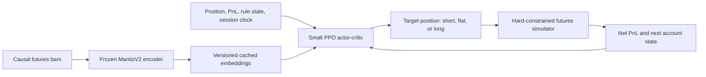

# Research: Foundation Models with Reinforcement Learning for Futures Trading

## Provenance

- Generated date: 2026-07-20
- Research scope: public papers, books, and implementations that combine a pretrained foundation model with an RL trading policy, plus futures RL pipelines that can accept frozen MantisV2 embeddings
- Target market: exchange-traded futures, including ordinary risk-adjusted trading and Topstep-style account constraints
- Source priority: primary papers, publisher pages, and official repositories
- Exclusions: RLHF that only aligns an LLM, prompted trading agents without a trained numerical policy, and non-trading applications
- Degraded tooling: no institutional journal subscriptions were used; some recent results are preprints without independent replication

## TL;DR

- **No credible public paper validates the complete target system: frozen foundation-model features -> RL policy -> intraday futures -> realistic costs and rolls -> Topstep rules.** The components exist separately, but the combined pipeline remains a research hypothesis.
- **ChronosRL is the closest direct architecture.** It freezes Chronos, uses 768-dimensional embeddings as RL observations, and trains DQN/PPO/A2C/RPPO. Its evidence is only five months of daily cryptocurrency data, with no public code found.
- **A June 2026 Chronos-plus-PPO portfolio paper is a useful warning, not proof.** Its primary equity test lasts 14 days, uses zero costs, reports negative Sharpe, and loses its alpha over longer windows.
- **The best public code seam is TorchTrade.** Its `ppo_chronos` example implements OHLCV -> frozen Chronos embeddings -> account state -> PPO, but the example is hourly BTC spot with zero fees and zero slippage.
- **The best first futures build is conservative:** keep MantisV2 frozen, cache causal embeddings, append position/account/rule state, and train a small discrete target-position PPO policy. Compare it against the current logistic strategy and raw-feature PPO under the same simulator.
- **Do not jointly fine-tune MantisV2 and PPO first.** Published examples show representation collapse, policy collapse, large seed variance, and cases where foundation-model signals make RL performance worse.

## What counts as a foundation-model-plus-RL trading pipeline

A direct pipeline has four distinct parts:

1. A model is pretrained on a broad corpus before the trading-policy experiment.
2. The pretrained model produces an embedding, forecast, text-derived signal, or policy representation.
3. An RL algorithm learns a trading, allocation, or execution policy from that representation.
4. The policy is tested chronologically on data not used to select the model, reward, or hyperparameters.

This definition excludes two common terminology traps:

- RLHF or reinforcement fine-tuning of an LLM is not automatically a trading RL policy.
- An LLM that writes a recommendation is not the same as a numerical policy trained on foundation-model features.

## Direct and adjacent examples

| Work | Foundation-model role | RL role | Market and timeframe | Evidence quality | Main lesson |
| --- | --- | --- | --- | --- | --- |
| [ChronosRL](https://doi.org/10.1016/j.procs.2025.07.132) | Frozen Chronos-small, 768-dimensional embedding | DQN, PPO, A2C, and recurrent PPO choose Buy/Sell/Hold | Six crypto pairs, daily, July-November 2024 | Low-to-medium | Closest direct frozen-TSFM architecture, but too short and unlike futures |
| [Three-Phase Foundation Model](https://arxiv.org/abs/2606.30997) | Frozen Chronos-T5-small fused with a self-supervised market encoder | PPO mixture-of-experts allocates equities and cash | US equities, daily | Low | Strong architecture and failure analysis; zero-cost, short, negative-Sharpe evaluation |
| [GPT-2 LoRA Decision Transformer](https://arxiv.org/abs/2411.17900) | Pretrained GPT-2 sequence backbone with LoRA | Offline return-conditioned policy imitation | 29 DJIA stocks, daily | Medium | Reproducible second-stage offline template, not online PPO |
| [GIFT](https://arxiv.org/abs/2606.08450) | LLM generates bounded causal state features and reward terms | PPO/A2C learns the policy after the interface is frozen | S&P 500 panels, daily | Medium | Use an LLM offline to design and audit the interface, not to make live trades |
| [FLAG-Trader](https://aclanthology.org/2025.findings-acl.716/) | Partially frozen SmolLM2 actor-critic backbone | PPO updates upper layers and policy/value heads | Five equities and BTC, daily | Low-to-medium | Direct joint training exists, but costs, splits, and futures controls are weak |
| [FinRL-DeepSeek](https://arxiv.org/abs/2502.07393) | Frozen LLM converts news into recommendation and risk scores | PPO/CVaR-PPO consumes those scores | Nasdaq-100, daily | Medium | Important negative control: adding an FM signal can reduce performance |
| [FPILOT](https://arxiv.org/abs/2605.12653) | Any price forecaster supplies an imagined future path at inference time | Optimizes a pretrained trading policy before each action | DJ30 benchmark | Medium-low | Natural future extension for Mantis forecasts, but not a futures or TSFM validation |
| [MarS](https://arxiv.org/abs/2409.07486) | Generative order-flow foundation model creates an interactive market | Policy-gradient agent learns execution | China A-shares, order-level execution | Medium | Shows an FM can sit under the environment rather than the observation; key weights are private |

### 1. ChronosRL: the closest direct frozen-encoder example

Lima, Oliveira, and Zanchettin feed a two-channel price/volume sequence through frozen Chronos-small and use the resulting 768-dimensional embedding as the state for DQN, PPO, A2C, and recurrent PPO. The action is Buy, Sell, or Hold, one position is allowed, and a 5% stop loss is applied. The paper reports mean ROI of 102.8%, cross-pair standard deviation of 79.7%, and a best DQN-plus-Chronos Sharpe of 0.78.

The result is not strong trading evidence. It covers only six cryptocurrency pairs and five months of daily bars. Public material does not establish a clean train/validation/test protocol, commissions, slippage, or code. Its value is the architectural seam: freeze the encoder, cache embeddings, append account state, and keep the RL policy small.

### 2. Chronos plus PPO: useful failures from the June 2026 paper

Pishehvar's three-phase system combines a self-supervised cross-asset encoder with a frozen 46M-parameter Chronos-T5-small branch. A small projection and learned gate fuse the features, while 99.97% of Chronos remains frozen. Embeddings are cached before PPO training. The PPO mixture-of-experts policy emits portfolio weights and Buy/Hold/Sell decisions.

The failures are more informative than the headline result:

- Direct multi-objective PPO training collapsed toward uniform allocations within about 100 episodes.
- Cross-asset representations collapsed to cosine similarity near 0.96 until an explicit contrastive loss reduced it to 0.24.
- The primary backtest covers 14 days, uses zero transaction costs, and reports annualized Sharpe near -6.6.
- The reported positive equal-weight alpha does not persist across 60- and 90-day windows.

For MantisV2, measure embedding similarity across symbols and regimes. A pretrained encoder is not automatically discriminative enough for a policy.

### 3. GIFT: a disciplined way to use an LLM around RL

GIFT does not place the LLM inside the live policy. It constrains the LLM to causal factor primitives and risk-rule templates, evaluates proposed state/reward interfaces through PPO rollouts, then freezes the selected interface before evaluation. It uses six rolling windows, a 20-day lookback, and 0.1% turnover cost. The paper reports that GIFT beats plain PPO in 160 of 180 metric comparisons.

This is relevant to workflow design, but it carries selection risk: repeatedly choosing interfaces using rollout Sharpe can overfit the design period. Any LLM-assisted reward or feature search must remain outside the final holdout.

### 4. FinRL-DeepSeek: negative evidence must be a baseline

FinRL-DeepSeek injects LLM news recommendations into PPO actions and LLM risk scores into CVaR-PPO rewards. At two million steps, plain PPO reports Information Ratio 0.0100, while PPO-DeepSeek at the 10% setting reports -0.0093. Some constrained-policy comparisons improve one metric while worsening another.

The lesson is direct: require a no-Mantis policy and a shuffled-embedding policy. Extra representation capacity can degrade decisions or tail risk.

## Futures RL papers that supply the missing environment and policy design

These papers do not use foundation models. They provide the futures half of the proposed system.

| Work | Market and timeframe | Policy | Evaluation strengths | Limitation |
| --- | --- | --- | --- | --- |
| [Goluza et al.](https://arxiv.org/abs/2406.08013) | Ten continuous commodity/FX futures, 1-minute, 2012-2021 | PPO, target position `{-1,0,+1}` | 27 rolling tests; one-year train, last month validation, four-month test; next-open execution; daily flattening | No official code found; 0.08 bp cost is too optimistic for many retail futures setups |
| [Zhang, Zohren, and Roberts](https://arxiv.org/abs/1911.10107) | 50 liquid continuous futures, daily, 2005-2019 | Discrete DQN/PG and continuous A2C sizing | Cross-asset tests, volatility scaling, heavy-cost sensitivity, classical trend baseline | Daily rather than intraday; no official repository found |
| [Hirsa et al.](https://papers.ssrn.com/sol3/papers.cfm?abstract_id=3867800) | E-mini S&P 500 continuous futures, daily | Long/short DQN | Direct ES example using real and simulated series | Authors call results preliminary; public material lacks the needed fill/cost/roll detail |
| [DeepScalper](https://doi.org/10.1145/3511808.3557283) | Six Chinese financial futures, 1-minute, with five-level order book | Branched dueling DQN selects limit price and quantity | Explicit fees, leverage, holding limit, and [public TradeMaster code](https://github.com/TradeMaster-NTU/TradeMaster) | Requires credible LOB, queue, latency, and partial-fill simulation |
| [MaxAI](https://papers.ssrn.com/sol3/papers.cfm?abstract_id=5761402) | CME NQ, more than four million one-minute observations | Q-agent plus genetic hyperparameter search | Includes commissions, slippage, spread, margin, and position sizing | No official code; genetic search raises selection risk; reported profit factor is only 1.07 |
| [FineFT](https://arxiv.org/abs/2512.23773) | Minute crypto perpetuals; appendix includes corn and ES | Ensemble DQNs with VAE-based conservative routing | Public code, costs, leverage, funding, OOD routing | Too complex for a first build; limited direct CME evidence |

### Why Goluza et al. is the best first-build policy template

The observation already separates market state from private account state. It includes position, position return, daily return, and time remaining. A position change executes at the next minute open, and the agent is flattened before the session ends. The target-position action `{-1,0,+1}` avoids the complexity of continuous contract sizing.

The paper's 27 rolling evaluations are much closer to the required workflow than a single train/test split. Its main caution is cost sensitivity: reported profitability tends to disappear above roughly 0.16 basis points. Local evaluation must use actual per-contract commission, tick value, spread, and slippage rather than borrowing that rate.

### Why Zhang, Zohren, and Roberts remains the required comparator

This work evaluates 50 liquid futures across commodities, equity indices, fixed income, and FX. It compares discrete and continuous policies, uses volatility-scaled positions and rewards, and includes a classical time-series momentum baseline. It is the best reference for the later continuous-sizing experiment, not the first intraday build.

## Recommended pipelines for MantisV2

### Pipeline A: frozen embeddings plus discrete PPO - recommended first



Observation:

```text
[
  mantis_embedding,
  current_position,
  average_entry,
  unrealized_pnl,
  realized_session_pnl,
  current_equity,
  distance_to_daily_loss_limit,
  distance_to_max_loss_floor,
  session_time_remaining,
  time_to_roll,
  valid_action_mask
]
```

Training and evaluation:

1. Cache embeddings from information available at the decision timestamp only.
2. Fit embedding normalization on the training fold only.
3. Train PPO on CPU with at least 10 fixed seeds.
4. Use short/flat/long one-unit target positions initially.
5. Fill no earlier than the next eligible bar and charge both sides of a reversal.
6. Use purged rolling train/validation/test folds and keep a final holdout sealed.
7. Compare every seed against flat, simple trend, the current logistic head, and raw-feature PPO.

Required ablations:

- Account state plus raw causal features.
- Account state plus real frozen MantisV2 embeddings.
- Account state plus shuffled frozen embeddings.
- Account state plus raw features and MantisV2 embeddings.

The shuffled condition tests whether additional dimensions alone appear to help. Do not replace the logistic classifier until the RL policy wins across folds and seeds after identical costs.

### Pipeline B: forecast-assisted RL - second choice

FPILOT optimizes an already-trained policy at inference time using an external price forecast. A future Mantis forecasting head or another qualified TSFM could supply the forecast path. This cleanly separates forecasting quality from policy learning, but it adds inference-time optimization and another failure surface.

Test it only after Pipeline A is stable. Compare policy-only, forecast-only/rule conversion, and policy-plus-forecast under identical latency and cost assumptions.

### Pipeline C: offline Decision Transformer - later experiment

The GPT-2 LoRA Decision Transformer paper provides a reproducible offline template. For futures, first create a diverse trajectory corpus from fixed policies: flat, time-series momentum, the logistic model, discrete PPO, and bounded exploratory policies. Then train a return-conditioned sequence policy over Mantis embeddings and account state.

Historical prices alone are not an offline RL dataset. The data must contain states, actions, rewards, next states, terminal flags, and the behavior policy that generated the action. Keep conservative offline-RL and behavior-cloning baselines because the pretrained transformer may not win.

### Pipeline D: jointly fine-tuned foundation model and PPO - do not start here

Joint updates create an unstable target for the policy, invalidate cached embeddings, increase on-policy compute, and risk erasing the encoder's pretrained representation. FLAG-Trader shows the concept, but its all-in/all-out daily experiments lack the evidence required for leveraged futures.

Attempt partial unfreezing or LoRA only after frozen embeddings show stable incremental value. Re-run all folds and monitor embedding drift, cross-symbol collapse, and native Mantis task degradation.

## Ordinary-return mode versus Topstep-style mode

Use the same execution mechanics but train separate policies.

### Ordinary-return policy

- Reward: marked-to-market PnL after commission and slippage, optionally scaled by ex-ante volatility.
- Report: net return, Sharpe, Sortino, Calmar, maximum drawdown, turnover, trades, and per-contract results.
- Hard limits: exchange margin, legal position size, session close, and roll behavior.

### Account-objective policy

- Keep net PnL as the core reward.
- Implement daily loss, trailing/end-of-day loss floor, maximum contracts, forced flattening, lockout, and terminal failure as environment transitions or action masks.
- Report: pass rate, failure rate by rule, median days to pass/fail, session lockouts, ordinary expectancy, and the full distribution across seeds and paths.

No public paper was found that trains an RL policy under Topstep or a complete futures prop-firm ruleset. Hard rules must not be left to reward shaping. A policy can learn that violating a soft penalty is worthwhile; the real account cannot.

## Staged recommendation with halt gates

1. **Environment parity.** Replay fixed action fixtures through the existing simulator and the RL environment. **Proceed only if** fills, PnL, costs, session boundaries, rolls, daily loss, and loss-floor transitions match exactly. **Halt on** any one-tick or one-bar timing mismatch.
2. **Raw-state PPO baseline.** Train the small discrete policy without Mantis. **Proceed only if** results are stable enough across folds and seeds to make an embedding ablation meaningful. **Halt on** best-seed-only profitability.
3. **Frozen MantisV2 ablation.** Add cached embeddings without changing the policy or simulator. **Commit to the FM seam only if** the median result improves after costs across every development fold and the lower-tail seed is not catastrophic. **Halt if** one extra tick of slippage removes the gain.
4. **Separate ordinary and account policies.** Select ordinary mode by net risk-adjusted return and account mode by pass/survival distribution. **Halt if** account-mode gains rely on worse ordinary expectancy or extreme time-to-pass.
5. **Continuous sizing or forecast assistance.** Add one component, not both. **Proceed only if** the improvement survives all folds, seeds, turnover, and margin assumptions.
6. **Keep the final holdout sealed.** Do not use it for rewards, state design, architecture, seed selection, thresholds, or model choice.

## Books and reading order

No book covers the complete foundation-model -> RL -> realistic futures/Topstep pipeline. The smallest useful stack is:

| Priority | Book | Role in this build | Limitation |
| --- | --- | --- | --- |
| 1 | Sutton and Barto, [*Reinforcement Learning: An Introduction*, 2nd ed.](https://mitpress.mit.edu/9780262039246/reinforcement-learning/) (MIT Press, 2018) | MDPs, temporal-difference learning, function approximation, off-policy learning, and policy gradients | No finance, TSFM, or constrained-account implementation |
| 2 | Ashwin Rao and Tikhon Jelvis, [*Foundations of Reinforcement Learning with Applications in Finance*](https://www.routledge.com/Foundations-of-Reinforcement-Learning-with-Applications-in-Finance/Rao-Jelvis/p/book/9781003229193) (CRC Press, 2023) | Best rigorous bridge from RL fundamentals to financial trading, asset allocation, hedging, and order-book problems; [public code](https://github.com/TikhonJelvis/RL-book) | Does not cover foundation models or a futures simulator |
| 3 | Yves Hilpisch, [*Reinforcement Learning for Finance: A Python-Based Introduction*](https://www.oreilly.com/library/view/reinforcement-learning-for/9781098169169/) (O'Reilly, 2024) | Shorter practical introduction to financial Q-learning, trading, hedging, and allocation | Not a TSFM or futures-account recipe |
| 4 | Marcos Lopez de Prado, [*Advances in Financial Machine Learning*](https://www.wiley.com/en-us/Advances+in+Financial+Machine+Learning-p-9781119482086) (Wiley, 2018) | Purging, embargoing, walk-forward limitations, backtest overfitting, and selection controls | Not an RL book; apply its controls to episodes and model selection |
| 5 | Eitan Altman, [*Constrained Markov Decision Processes*](https://www-sop.inria.fr/members/Eitan.Altman/mdp1.html) (CRC Press, 1999) | Formal basis for costs and constraints in MDPs | Theory-heavy and does not replace hard environment rules |
| 6 | Larry Harris, [*Trading and Exchanges*](https://academic.oup.com/book/52292) (Oxford University Press, 2002) | Orders, spreads, liquidity, transaction costs, and execution realism | Predates current electronic futures details; pair with current exchange rules |
| 7 | Dixon, Halperin, and Bilokon, [*Machine Learning in Finance*](https://link.springer.com/book/10.1007/978-3-030-41068-1) (Springer, 2020) | Deeper finance RL, inverse RL, imitation learning, and mathematical context | Dense and still lacks a TSFM-to-futures pipeline |

For current foundation-model background, add Liu et al., ["Foundation Models for Time Series Analysis: A Tutorial and Survey"](https://arxiv.org/abs/2403.14735) and the exact MantisV2 paper/source pinned by this repository. A survey is more useful here than an older book because the TSFM field is changing quickly.

## Public code worth studying

### TorchTrade `ppo_chronos`

- Repository: [TorchTrade](https://github.com/TorchTrade/torchtrade)
- Example: [`examples/online_rl/ppo_chronos`](https://github.com/TorchTrade/torchtrade/tree/main/examples/online_rl/ppo_chronos)
- Transform: [`ChronosEmbeddingTransform`](https://github.com/TorchTrade/torchtrade/blob/main/torchtrade/envs/transforms/chronos_embedding.py)

The example implements the desired seam: OHLCV -> pretrained Chronos embedding -> account state -> MLP -> PPO policy/value heads. The encoder runs under `torch.no_grad()`. The checked example uses hourly BTC/USD, a 24-bar context, long/flat actions, 1x leverage, zero transaction fees, and zero slippage. Borrow the interface and PPO wiring, not the experiment assumptions.

### TradeMaster and DeepScalper

[TradeMaster](https://github.com/TradeMaster-NTU/TradeMaster) supplies a public PyTorch implementation of advanced financial RL, including DeepScalper. It is useful if this project later adds limit-order-book execution. It is not a ready CME/Topstep environment.

### FinRL and FinRL-Meta

[FinRL](https://github.com/AI4Finance-Foundation/FinRL) and [FinRL-Meta](https://github.com/AI4Finance-Foundation/FinRL-Meta) provide financial RL algorithms and standardized stock/crypto/forex environments. Borrow algorithm and interface ideas; do not make their market environment the source of truth for futures fills or prop rules.

### TorchRL

[TorchRL](https://pytorch.org/rl/stable/) is the most natural low-level component source for a PyTorch-native repository. Its TensorDict specifications, collectors, PPO loss, generalized advantage estimation, and storage components can sit around a locally controlled futures environment.

## Caveats and negative findings

- **No complete precedent.** No paper or repository found combines Mantis, Chronos, TimesFM, Moirai, or another TSFM with RL and validates it on intraday CME futures with costs, rolls, margin, purged walk-forward tests, and an untouched holdout.
- **No Topstep study.** Exact searches for Topstep, prop-firm, daily-loss-limit, and trailing-drawdown RL pipelines found no academic implementation.
- **Foundation features may hurt.** FinRL-DeepSeek and the Chronos portfolio paper show degradation, collapse, or unstable objectives after adding pretrained-model signals.
- **RL comparisons need many seeds.** Deep-RL results can vary materially with randomness and nondeterministic hardware. Report every seed and confidence interval, not the best checkpoint.
- **Costs can reverse rankings.** Futures RL papers show strategy profitability and even algorithm ranking can change under different cost models.
- **Continuous contracts are not executable contracts.** Use adjusted series for features, but calculate fills and PnL on the actual dated contract. A roll is two trades, not free continuity.
- **Offline RL needs behavior data.** A price history without recorded actions and rewards is not an offline-policy dataset.
- **Recent papers are frontier evidence.** Several direct examples are 2025-2026 preprints with little or no independent replication.

## Completion table

| Research item | Status | Result |
| --- | --- | --- |
| Direct FM-conditioned RL trading papers | Complete | Several equity/crypto examples; no credible futures validation |
| Futures RL pipelines transferable to MantisV2 | Complete | Five main archetypes; discrete PPO recommended first |
| Ordinary return and Topstep-style objectives | Complete | Separate policies with shared mechanics; no direct Topstep paper |
| Frozen versus joint foundation-model training | Complete | Frozen/cached recommended; joint training deferred |
| Books | Complete | No single complete book; seven-source reading stack provided |
| Public implementations | Complete | TorchTrade is closest seam; TradeMaster/FinRL/TorchRL are component sources |

## Primary sources

1. Lima, Oliveira, and Zanchettin (2025), "ChronosRL: Embeddings-Based Reinforcement Learning Agent for Financial Trading," *Procedia Computer Science* 264:211-220, [DOI 10.1016/j.procs.2025.07.132](https://doi.org/10.1016/j.procs.2025.07.132).
2. Pishehvar (2026), "A Three-Phase Foundation Model for Tax-Aware Personalized Portfolio Management," [arXiv:2606.30997](https://arxiv.org/abs/2606.30997).
3. Yun (2024), "Pretrained LLM Adapted with LoRA as a Decision Transformer for Offline RL in Quantitative Trading," [arXiv:2411.17900](https://arxiv.org/abs/2411.17900).
4. Wu et al. (2026), "GIFT: LLM-Guided State-Reward Interface for Financial Reinforcement Learning," [arXiv:2606.08450](https://arxiv.org/abs/2606.08450).
5. Xiong et al. (2025), "FLAG-Trader: Fusion LLM-Agent with Gradient-Based Reinforcement Learning for Financial Trading," *Findings of ACL 2025*, [paper](https://aclanthology.org/2025.findings-acl.716/).
6. Benhenda (2025), "FinRL-DeepSeek: LLM-Infused Risk-Sensitive Reinforcement Learning for Trading Agents," [arXiv:2502.07393](https://arxiv.org/abs/2502.07393).
7. Go, Deb, and Banerjee (2026), "Plan Before You Trade: Inference-Time Optimization for RL Trading Agents," [arXiv:2605.12653](https://arxiv.org/abs/2605.12653).
8. Li et al. (2025), "MarS: A Financial Market Simulation Engine Powered by Generative Foundation Model," ICLR 2025, [arXiv:2409.07486](https://arxiv.org/abs/2409.07486).
9. Goluza et al. (2024), "Deep Reinforcement Learning with Positional Context for Intraday Trading," [arXiv:2406.08013](https://arxiv.org/abs/2406.08013).
10. Zhang, Zohren, and Roberts (2020), "Deep Reinforcement Learning for Trading," *Journal of Financial Data Science*, [arXiv:1911.10107](https://arxiv.org/abs/1911.10107).
11. Hirsa et al. (2021), "Deep Reinforcement Learning on a Multi-Asset Environment for Trading," [SSRN 3867800](https://papers.ssrn.com/sol3/papers.cfm?abstract_id=3867800).
12. Sun et al. (2022), "DeepScalper: A Risk-Aware Reinforcement Learning Framework to Capture Fleeting Intraday Trading Opportunities," CIKM, [DOI 10.1145/3511808.3557283](https://doi.org/10.1145/3511808.3557283).
13. Huber (2025), "MaxAI: A Reinforcement Learning and Genetic Algorithm Framework for Intraday Index Futures Trading," [SSRN 5761402](https://papers.ssrn.com/sol3/papers.cfm?abstract_id=5761402).
14. Qin et al. (2026), "FineFT: Efficient and Risk-Aware Ensemble Reinforcement Learning for Futures Trading," [arXiv:2512.23773](https://arxiv.org/abs/2512.23773).
15. Achiam et al. (2017), "Constrained Policy Optimization," ICML, [PMLR 70:22-31](https://proceedings.mlr.press/v70/achiam17a.html).
16. Huang and Ontanon (2020), "A Closer Look at Invalid Action Masking in Policy Gradient Algorithms," [arXiv:2006.14171](https://arxiv.org/abs/2006.14171).
17. Henderson et al. (2018), "Deep Reinforcement Learning That Matters," AAAI, [DOI 10.1609/aaai.v32i1.11694](https://doi.org/10.1609/aaai.v32i1.11694).
18. Liu et al. (2022), "FinRL-Meta: Market Environments and Benchmarks for Data-Driven Financial Reinforcement Learning," NeurIPS Datasets and Benchmarks, [paper](https://proceedings.neurips.cc/paper_files/paper/2022/file/0bf54b80686d2c4dc0808c2e98d430f7-Paper-Datasets_and_Benchmarks.pdf).

## Methodology

Research covered arXiv, SSRN, publisher records, conference proceedings, DOI pages, and official GitHub repositories. Searches combined foundation-model names with reinforcement learning, trading, futures, embeddings, PPO, Decision Transformer, constrained RL, Topstep, prop-firm, daily-loss, and trailing-drawdown terms. Direct systems were separated from LLM-assisted feature design, RLHF, execution simulation, and ordinary futures RL. Recommendations synthesize the strongest available component evidence; they are not claims that the combined MantisV2 futures system has already been validated.
